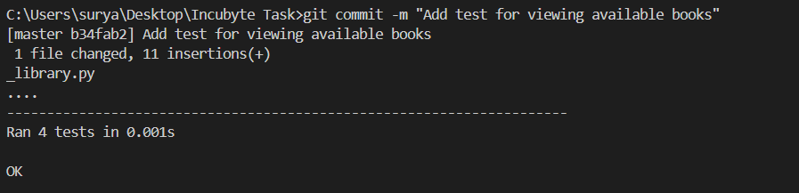

# Library Management System

This is a simple library management system implemented in Python. The system allows users to perform the following operations:
- Add books to the library.
- Borrow books.
- Return books.
- View the list of available books.

The system is developed following **Test-Driven Development (TDD)** principles, ensuring high test coverage and reliability.

## Features
- **Add Books**: Users can add new books with a unique identifier (ISBN), title, author, and publication year.
- **Borrow Books**: Users can borrow books if they are available.
- **Return Books**: Users can return borrowed books, making them available again.
- **View Available Books**: Users can view all books currently available in the library.

## Requirements
- Python 3.x
- `unittest` module (comes pre-installed with Python)

## Setup and Installation

1. **Clone the repository**:
    ```bash
    git clone <remote-repository-url>
    cd library-management-system
    ```

2. **Create and activate a virtual environment (optional but recommended)**:
    ```bash
    python -m venv venv
    source venv/bin/activate  # On Windows: venv\Scripts\activate
    ```
## Running Tests

The project includes comprehensive unit tests for all core functionalities, located in the `test_library.py` file.

1. **Run all tests**:
    ```bash
    python -m unittest test_library.py
    ```

2. **View detailed test output**:
    ```bash
    python -m unittest -v test_library.py
    ```

All tests should pass before the implementation is considered complete. Here's an example of how the output will look if all tests pass:





## TDD Workflow

The project follows a strict Test-Driven Development (TDD) approach. Each feature was developed using the following steps:

1. Write a test for the feature.
2. Implement the feature in the `Library` class.
3. Ensure the test passes.
4. Commit changes to the Git repository.

Example TDD workflow using Git:

```bash

git add test_library.py
git commit -m "Add test for adding books"


git add library.py
git commit -m "Implement add book feature"


